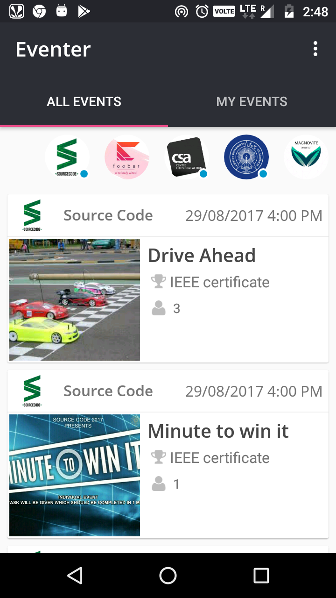

# Eventer Android App

*Event Management App*

Morden, social and minimalistic event management app which allows to set up events 
and conduct registrations in no time.

**[Install on Google Play](https://play.google.com/store/apps/details?id=com.eventer.app)**

<h2>Features</h2>

With the app, organizers can:

- Create events and manage registrations in real time.
- Notify event specific particpant through custom push notification
- Get registration details as excel sheets(csv). (App required)
- Get registration details in Google sheets (No App Required)
- Promote upcoming event through whatsapp-styled stories.
- Create custom signup using your own backend.

With the app, participants can:

- One-Click registration
- Know all the helpful detail at one place like contacts, winners list etc.
- Ask event specific doubt in live discussion panel.
- Watch event promo and live videos.

<h2>Google Sheets sync using Cloud Functions</h2>

On successful registration, Google sheets is updated with the registered participants details using Cloud Functions Database Trigger

<h2>Image Notification</h2>

Organizers can send custom data notification to participation based on topics.

